# 🌐 Network Compliance Auditor

A powerful Python tool for auditing network device configurations against compliance standards. SSH into your fleet of routers/switches, extract running configs, and compare them against golden templates to identify security and configuration violations.


## architecture 

```mermaid
    graph TD
    
    A["🖥️ Network Compliance Auditor<br/>CLI Interface"] --> B{"🔄 Mode Selection"}
    
    B --> C["🎭 Simulation Mode<br/>(Default)"]
    B --> D["🔗 Real Device Mode<br/>(SSH)"]
    
    C --> E["📋 Simulated Devices<br/>• Router1<br/>• Switch1"]
    D --> F["🌐 Real Network Devices<br/>• SSH Connection<br/>• Config Extraction"]
    
    E --> G["📄 Sample Configurations<br/>Cisco IOS Router/Switch"]
    F --> H["💾 Device Configs<br/>Saved to files"]
    
    G --> I["🔍 Compliance Engine"]
    H --> I
    
    I --> J["📋 Compliance Rules<br/>• Enable Secret<br/>• SSH Access<br/>• Telnet Disabled<br/>• Password Encryption<br/>• NTP/Logging/ACLs"]
    
    J --> K["⚖️ Rule Processing<br/>Pattern Matching"]
    
    K --> L["📊 Violation Detection<br/>• Missing Configs<br/>• Forbidden Configs<br/>• Severity Levels"]
    
    L --> M["📈 Rich Console Report<br/>• Summary Tables<br/>• Detailed Violations<br/>• Color-coded Output"]
    
    L --> N["📁 YAML Export<br/>compliance_report_timestamp.yaml"]
    
    style A fill:#e1f5fe
    style I fill:#f3e5f5
    style J fill:#fff3e0
    style M fill:#e8f5e8
    style N fill:#fff8e1
```


## 🚀 Features

- **Multi-Device Support**: Cisco IOS, Juniper, Arista devices
- **SSH Connectivity**: Secure remote configuration extraction
- **Simulation Mode**: Test without real hardware
- **Rich Reporting**: Beautiful console output with colors and tables
- **YAML Export**: Export detailed compliance reports
- **Configurable Rules**: Customize compliance checks
- **Real-time Progress**: Track audit progress across devices

## 📋 What It Does

1. **SSH Connection**: Establishes secure SSH connections to network devices
2. **Config Extraction**: Runs `show running-config` or equivalent commands
3. **Compliance Checking**: Compares configurations against predefined rules
4. **Violation Detection**: Identifies missing or incorrect configurations
5. **Report Generation**: Creates detailed compliance reports
6. **Export Results**: Saves results to timestamped YAML files

## 🛠 Installation

This project uses `uv` for dependency management. Make sure you have `uv` installed:

```bash
# Install uv if you haven't already
curl -LsSf https://astral.sh/uv/install.sh | sh

# Clone the repository
git clone <your-repo-url>
cd network-com-audit

# Install dependencies
uv sync
```

### Dependencies

The tool uses several key libraries:
- `paramiko` - SSH connectivity to network devices
- `pyyaml` - Configuration template parsing
- `rich` - Beautiful console output and formatting
- `click` - Command-line interface framework
- `textfsm` - Network configuration parsing (future enhancement)

## 🎯 Quick Start

### 1. Run Demo Mode
Get started immediately with simulated devices:

```bash
python main.py demo
```

### 2. List Available Commands
```bash
python main.py --help
```

### 3. View Compliance Rules
```bash
python main.py list-rules
```

### 4. Run Simulation Audit
```bash
python main.py audit --simulation
```

## 📖 Usage Examples

### Simulation Mode (Default)
Perfect for testing and demonstration:

```bash
# Run audit against simulated Router1 and Switch1
python main.py audit

# Or explicitly specify simulation mode
python main.py audit --simulation
```

### Real Device Mode
For auditing actual network devices:

```bash
# First, add devices to audit (in a real implementation)
python main.py add-device -h 192.168.1.1 -u admin -p password

# Run audit against real devices
python main.py audit --real
```

### Other Commands

```bash
# Show tool information
python main.py info

# List all compliance rules
python main.py list-rules

# Run demonstration with explanations
python main.py demo
```

## 🏗 Project Structure

```
network-com-audit/
├── src/network_auditor/
│   ├── __init__.py              # Package initialization
│   ├── auditor.py               # Main auditor orchestration
│   ├── device.py                # Device SSH handling & simulation
│   └── compliance.py            # Compliance checking engine
├── templates/
│   └── cisco_ios_golden_config.yaml  # Golden configuration template
├── configs/                     # Extracted device configurations
├── main.py                      # CLI entry point
├── pyproject.toml              # Project configuration
└── README.md                   # This file
```

## 🔍 Compliance Rules

The auditor checks for common network security and configuration standards:

### High Severity Rules
- ✅ Enable secret must be configured
- ✅ SSH access should be configured
- ❌ Telnet access should be disabled
- ✅ Password encryption should be enabled

### Medium Severity Rules
- ✅ Logging should be configured
- ✅ NTP server should be configured
- ✅ Access lists should be configured

### Low Severity Rules
- ✅ SNMP community should be configured

## 📊 Sample Output

```
🌐 Network Compliance Auditor
Audit your network infrastructure for compliance violations

🔍 STARTING NETWORK COMPLIANCE AUDIT

Running in SIMULATION mode
Using pre-configured Router1 and Switch1 with sample configs

Auditing devices... ━━━━━━━━━━━━━━━━━━━━━━━━━━━━━━━━━━━━━━━━ 100% 0:00:02

🔍 Auditing Router1
Simulating audit for Router1...
Checking compliance for Router1...

🔍 Auditing Switch1
Simulating audit for Switch1...
Checking compliance for Switch1...

📊 COMPLIANCE AUDIT REPORT

                    Compliance Summary                     
┏━━━━━━━━━━┳━━━━━━━━━━━━━━━━━━┳━━━━━━┳━━━━━━━━┳━━━━━┳━━━━━━━━━┓
┃ Device   ┃ Total Violations ┃ High ┃ Medium ┃ Low ┃ Status  ┃
┡━━━━━━━━━━╇━━━━━━━━━━━━━━━━━━╇━━━━━━╇━━━━━━━━╇━━━━━╇━━━━━━━━━┩
│ Router1  │        3         │  2   │   1    │  0  │ 🔴 FAIL │
│ Switch1  │        2         │  1   │   1    │  0  │ 🔴 FAIL │
└──────────┴──────────────────┴──────┴────────┴─────┴─────────┘
```


## 🔧 Configuration

### Device Simulation
The tool includes realistic device configurations:

- **Router1**: Cisco router with OSPF, interfaces, and access lists
- **Switch1**: Cisco switch with VLANs, trunking, and management

### Compliance Rules
Rules are defined in `src/network_auditor/compliance.py` and can be customized:

```python
ComplianceRule(
    name="enable_secret_configured",
    description="Enable secret must be configured",
    pattern=r"^enable secret",
    required=True,
    severity="HIGH"
)
```

### Golden Templates
YAML templates in `templates/` directory define expected configurations:

```yaml
global_config:
  - pattern: "service password-encryption"
    description: "Enable password encryption"
    required: true
    severity: "HIGH"
```

## 🔐 Security Considerations

- **SSH Keys**: Implement SSH key authentication for production use
- **Credentials**: Store credentials securely (environment variables, vault)
- **Access Control**: Restrict auditor tool access to authorized personnel
- **Logging**: Enable comprehensive logging for audit trails

## 🚀 Real-World Usage

### For Production Networks:

1. **Device Inventory**: Maintain a YAML file with device details
2. **Credential Management**: Use environment variables or secure vaults
3. **Scheduling**: Run audits via cron jobs or CI/CD pipelines
4. **Alerting**: Integrate with monitoring systems for violation alerts
5. **Reporting**: Export to ticketing systems or compliance databases

### Example Production Configuration:

```yaml
# devices.yaml
devices:
  - hostname: "core-router-01.company.com"
    username: "auditor"
    device_type: "cisco_ios"
    location: "DC1"
  - hostname: "access-switch-02.company.com"
    username: "auditor"
    device_type: "cisco_ios"
    location: "Office1"
```

## 🤝 Contributing

1. Fork the repository
2. Create a feature branch
3. Add tests for new compliance rules
4. Submit a pull request

## 📝 License

This project is licensed under the MIT License - see the LICENSE file for details.

## 🐛 Troubleshooting

### Common Issues:

1. **SSH Connection Failed**
   - Verify device IP/hostname
   - Check SSH credentials
   - Ensure SSH is enabled on device
   - Verify network connectivity

2. **Import Errors**
   - Run `uv sync` to install dependencies
   - Check Python version (>=3.12 required)

3. **Permission Denied**
   - Verify user has sufficient privileges
   - Check device access control lists

## 📞 Support

For issues, feature requests, or questions:
- Create an issue on GitHub
- Check the troubleshooting section
- Review the compliance rules documentation

---

**Happy Auditing! 🎉**

*Keep your network secure and compliant with automated configuration audits.*


